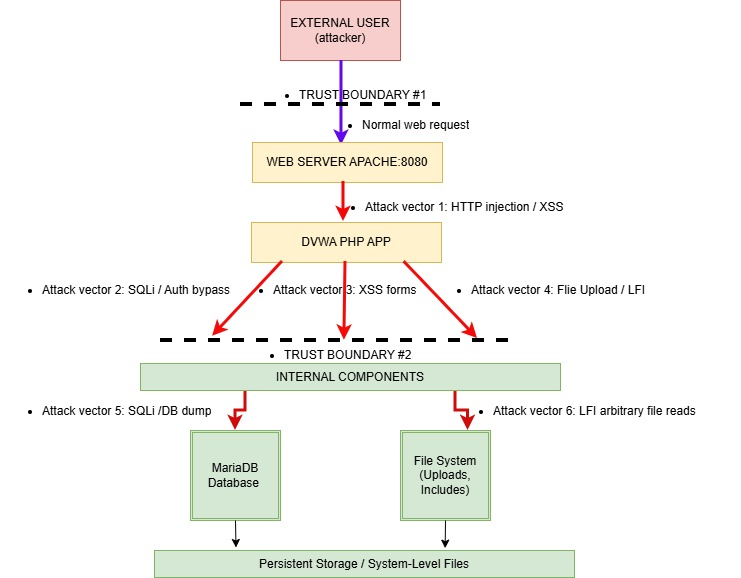

# 03 – Threat Modeling

## Objective

The objective of this phase is to identify and analyze potential threats to the
target environment by examining assets, attack surface, trust boundaries, and
likely attacker paths.

This threat model is based exclusively on information gathered during the
reconnaissance phase and on static analysis of application components.
No exploitation was performed during this phase.

---

## Target Context

The target environment consists of the **Damn Vulnerable Web Application (DVWA)**
running in a Docker-based laboratory environment.

### High-Level Components

- Client (attacker-controlled web browser)
- Web application (Apache + PHP)
- Database backend (MariaDB)
- Docker bridge network
- Host operating system (out of scope)

The database is not directly exposed to the host or external network.

---

## Asset Inventory & Classification

The following assets were identified and classified based on their value and
potential impact if compromised.

### Critical Assets

- **User Credentials Database**
  - Value: High
  - Impact: Authentication bypass, credential disclosure

- **Application Database (MariaDB)**
  - Value: Medium–High
  - Impact: Data manipulation, stored payload injection, integrity loss

- **DVWA Web Application Availability**
  - Value: Medium
  - Impact: Loss of availability for training and testing

- **Docker-Based Server Infrastructure**
  - Value: High
  - Impact: Command execution, container-level compromise

- **User Session Data (PHPSESSID, security cookie)**
  - Value: Medium
  - Impact: Session hijacking, impersonation

### Data Classification

- **Public:** Static pages, instructions, general UI
- **Internal:** PHP source code, application logic
- **Confidential:** User credentials, session cookies
- **Restricted:** Database credentials, internal configuration files

---

## Attack Surface Analysis

### External Attack Surface

The primary external attack surface is the HTTP service exposed by DVWA.

**Key Entry Points**
- `/login.php` – Authentication
- `/vulnerabilities/*` – Vulnerability modules (SQLi, XSS, LFI, Upload, Exec)
- `/setup.php` – Database initialization/reset
- `/security.php` – Security level configuration
- `/phpinfo.php` – PHP configuration disclosure

All modules accept user input and are reachable without network-level restrictions.

---

### Internal Attack Surface

- SQL queries constructed by PHP backend
- File system access via include, upload, and execution functionality
- Session management logic (cookies and tokens)
- Inter-container communication with MariaDB

---

### Network Attack Surface

- Internal Docker bridge network
- MySQL communication on port 3306 (internal only)

While not externally exposed, this surface becomes relevant after application compromise.

---

## Trust Boundaries

The following trust boundaries were identified:

1. **Client → Web Application**
   - User-controlled input crosses directly into backend logic

2. **Web Application → Database**
   - SQL queries built dynamically from user input

3. **Web Application → File System / OS**
   - PHP functions interacting with local files and system commands

4. **Container Boundary**
   - Isolation between web and database containers

Each boundary represents a potential escalation point for an attacker.

---

## Attack Vector Analysis

### Attack Vector 1 – SQL Injection

- Entry Point: `/login.php`, `/vulnerabilities/sqli/`
- STRIDE: Spoofing, Tampering
- Description: Injection of SQL payloads into authentication and query parameters
- Impact:
  - Authentication bypass
  - Database enumeration
  - Data extraction
  - Potential system-level impact

---

### Attack Vector 2 – Cross-Site Scripting (XSS)

- Entry Points:
  - `/vulnerabilities/xss_r/`
  - `/vulnerabilities/xss_s/`
- STRIDE: Tampering, Information Disclosure
- Description: Injection of malicious JavaScript via unsanitized inputs
- Impact:
  - Session hijacking
  - Credential theft
  - User impersonation

---

### Attack Vector 3 – Local File Inclusion (LFI)

- Entry Point: `/vulnerabilities/fi/`
- STRIDE: Information Disclosure, Elevation of Privilege
- Description: Path traversal via file inclusion parameters
- Impact:
  - Sensitive file disclosure
  - Source code exposure
  - Potential remote code execution

---

## STRIDE Analysis by Component

### Web Server (Apache / PHP)

- Spoofing: Host header manipulation
- Tampering: Request manipulation
- Repudiation: Lack of effective logging
- Information Disclosure: Version banners, directory exposure
- Denial of Service: Out of scope
- Elevation of Privilege: PHP execution abuse

---

### Authentication System

- Spoofing: SQL injection bypass
- Tampering: Session parameter manipulation
- Repudiation: No login audit trail
- Information Disclosure: Error-based username enumeration
- Elevation of Privilege: Unauthorized access to restricted modules

---

### Database Layer

- Spoofing: Execution of queries as privileged DB user
- Tampering: Modification of application tables
- Information Disclosure: Schema and data leakage
- Elevation of Privilege: Writing arbitrary data or files

---

### PHP Application Logic

- Spoofing: Bypassing input validation
- Tampering: Parameter manipulation
- Repudiation: No application-level logging
- Information Disclosure: Source code exposure
- Elevation of Privilege: Command execution and file upload abuse

---

## Attack Chain Scenarios

The following chained attack paths were identified:

1. **LFI → Source Code Disclosure → SQL Injection**
2. **XSS → Session Hijacking → Privilege Escalation**
3. **SQL Injection → Database Access → File System Access**

These chains represent high-risk scenarios in real-world deployments.

---

## Risk Prioritization

| Threat | Likelihood | Impact | Risk |
|------|------------|--------|------|
| SQL Injection | High | Critical | Critical |
| XSS (Stored / Reflected) | High | High | High |
| Local File Inclusion | Medium | High | High |
| Weak Session Handling | Medium | Medium | Medium |

---

## Threat Modeling Summary

This threat modeling phase established:

- High-value assets and their sensitivity
- Key trust boundaries and attack surfaces
- Likely attacker paths and escalation scenarios
- Risk-driven prioritization for testing

The results directly inform the Vulnerability Assessment phase.

---

## Transition to Next Phase

➡️ **04 – Vulnerability Assessment**

The next phase focuses on:
- Confirming exploitable weaknesses
- Collecting technical evidence
- Assigning severity and impact
